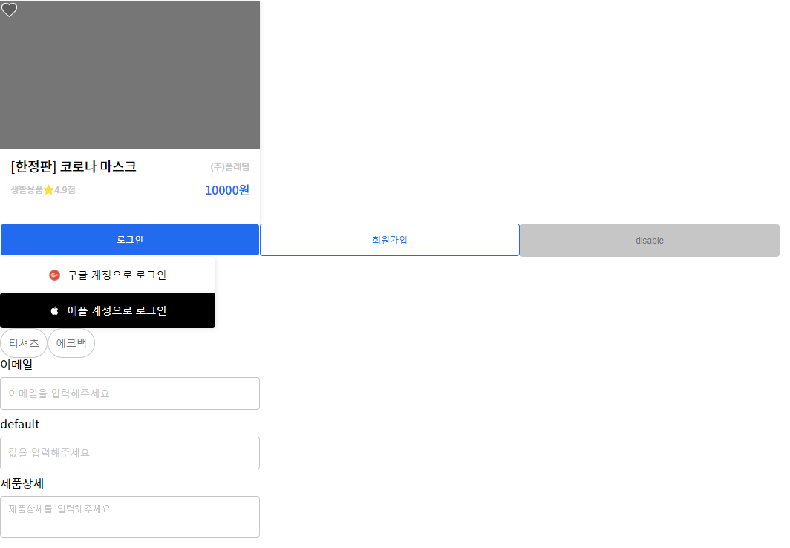

# EduPopKorn UI  

<p align="center">
   
</p>

## how to use?  
(I'm still working on it)

### Button

```javascript
<Button text="로그인" primary />
<Button text="회원가입" />
<Button text="disable" disabled />
```

### Card
```javascript
<Card
  Name={"[한정판] 코로나 마스크"}
  Owner={"(주)플래텀"}
  Category={"생활용품"}
  Score={4.9}
  Price={10000}
  isLiked={false}
/>
```

### Input
```javascript
<Input placeholder="이메일을 입력해주세요" name="이메일" />
<Input />
```


### LoginButton
```javascript
<LoginButton provider="google" text="구글 계정으로 로그인" />
<LoginButton provider="apple" text="애플 계정으로 로그인" />
```

### Tag
```javascript
<Tag text="티셔츠" />
<Tag text="에코백" />
```

### TextArea  
```javascript
<TextArea placeholder="제품상세를 입력해주세요" name="제품상세" />
```